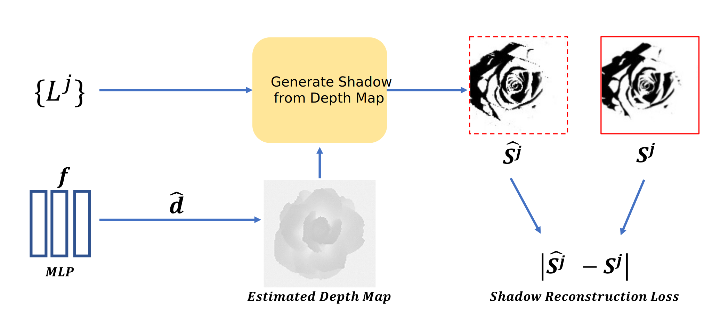

# DeepShadow: Neural Shape from Shadow
This repository is the code 
implementation for ECCV 2022 paper:
"DeepShadow: Neural Shape from Shadow".

The overview of our architecture is shown below:



## Requirements

* torch > 1.8
* opencv-python > 4.1
* numpy
* kornia > 0.6
* matplotlib
* einops > 0.3.1
* python

Our code was tested using Python 3.7/3.8 under Ubuntu 18.04, with GPU and/or CPU.

## Dataset Used in Paper
Download the data from https://faculty.runi.ac.il/toky/Pub/DeepShadowData.zip and unzip to ./data 
The data contains the six objects used in the paper, and their corresponding
images, shadows, point light locations and camera parameters. 
Each object also contains the silhouette, GT depth map (in exr format) 
and Surface Normal map.

## Reconstructing results from the paper
1. Clone the repo -
```bash
git clone https://github.com/asafkar/deep_shadow.git
cd deep_shadow/
```
2. Download and unzip the data
```bash
wget https://faculty.runi.ac.il/toky/Pub/DeepShadowData.zip
unzip DeepShadowData.zip -d ./data/
```
3. Install requirements
```bash
pip install -r requirements.txt
```
4. Run optimization on one of the objects in the 'data' folder
```bash
python train.py --object <object name>
```


## Citation
If you use the code, model or dataset in your own research, please cite:
```
@inproceedings{karnieli2022deepshadow,	
		title={DeepShadow: Neural shape from shadows},
		author={Asaf Karnieli, Ohad Fried, Yacov Hel-Or},	
		year={2022},	
		booktitle={ECCV},
}
```


